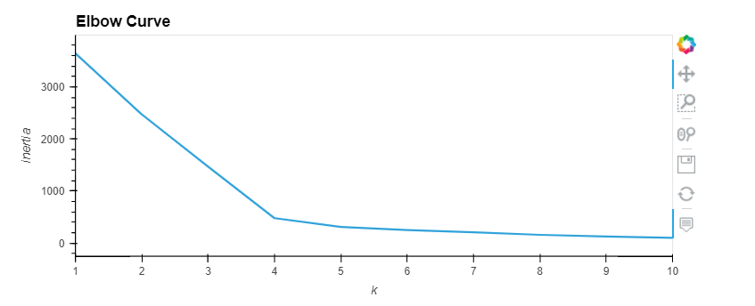
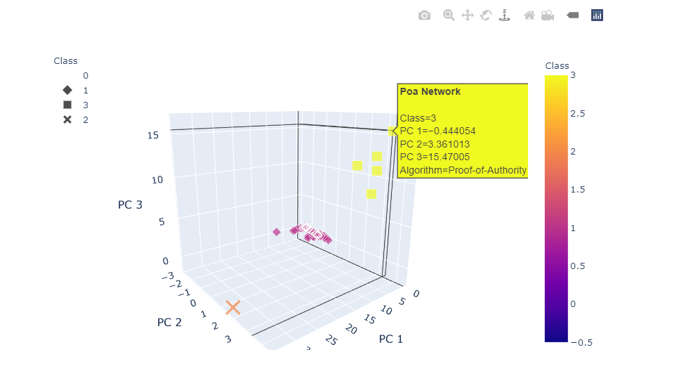
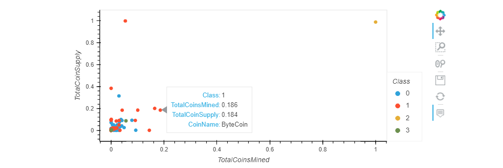
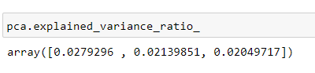

# Cryptocurrencies

## Overview
The project is to create a report that includes what cryptocurrencies are on the trading market and how they could be grouped to create a classification system for this new investment.

The data is not ideal so that we used unsuperivsed learning to process it to fit the machine learning models.

## Result
First, we filtered out the data which has been traded, includes algorithm, and has been mined. Moreover, the NaN data was deleted and then data transformed by standard scaler to reduce the likelihood that large values will unduly influence the model.

Then, we use PCA to reduce data dimensions into 3 since its features increases to 98 after "Algorithm" and "ProofType" information were encoded.

Next, we created ealbow curve and found that point 4 is considered the elbow. Therefore, we use 4 groups of clustering in K-Means algorithm and plot the data with outcome result by 3D-scatter.

Finally, we use MinMaxScaler to transform TotalCoinSupply and TotalCoinsMined by scaling to given range. Then, we plot scaled data into scatter chart.

# Summary

1. The data rows reduce from 1,144 to 532 after filtered Istrading, lgorithm, TotalCoinsMined, NaN.

2. The Elbowcurve suggests that after K values for point 4 represents the elbow.

3. From 3D scatter plot by the Plotly Express, we could visually see the result of how data distributing after data was transformed by standard scaler, reduced dimensions by PCA, and clustered by K-Means algorithm.

4. From 2D scatter plot by hvplot, we could visually see the result of how TotalCoinsMined and otalCoinSupply distributing after data was transformed by MinMaxScaler.

5. I have looked up the pca explained variance ratio and each component takes about 2% of the variance. In other words, roughly 94% of the data was lost in dimensionality reduction performed by PCA. Therefore, I think the project should modify with more than 3 components while conducting PCA to get a better resemblance data.

